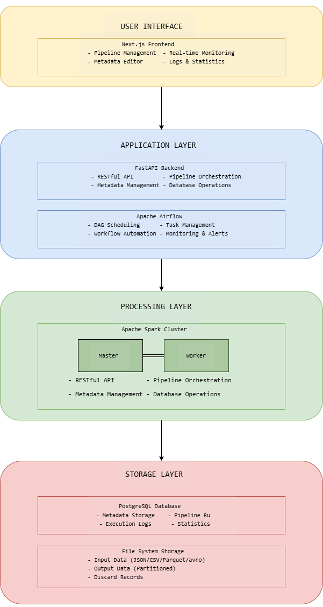

# Ominimo Motor Insurance Pipeline

A comprehensive, production-ready data pipeline platform for motor insurance policy processing with modern web interface, Airflow orchestration, and distributed Spark processing.

---

## Table of Contents

- [Features](#features)
- [Architecture](#architecture)
- [Prerequisites](#prerequisites)
- [Quick Start](#quick-start)
- [Service URLs](#service-urls)
- [Metadata Specification](#metadata-specification)


---

## Features

### Core Capabilities
- **Metadata-Driven Architecture**: Define entire data pipelines through JSON configuration
- **Dual Execution Modes**: 
  - Direct execution for immediate processing
  - Airflow scheduling for automated workflows (daily at 2 AM)
- **Dynamic Validation Engine**: 10+ built-in validators configurable via metadata
- **Real-time Monitoring**: Track pipeline execution with detailed logs and metrics
- **Quality Assurance**: Automated data quality checks with configurable thresholds

### Modern UI
- **React/Next.js Frontend**: Responsive, modern interface
- **Real-time Updates**: Live pipeline status and logs
- **Metadata Management**: Upload, edit, and manage pipeline configurations
- **Visual Monitoring**: Pipeline execution graphs and statistics
- **Error Tracking**: Detailed error logs and debugging information

### Performance
- **Distributed Processing**: Apache Spark cluster for parallel data processing
- **Scalable Architecture**: Horizontal scaling support for workers
- **Efficient Storage**: Partitioned output with multiple format support
- **Database Persistence**: All metadata and runs stored in PostgreSQL

---

## Architecture



## Quick Start

### 1. Clone Repository
```bash
git clone https://github.com/mouadhfraj/ominimo-pipeline.git
cd ominimo-pipeline
```


### 2. Build Custom Airflow Image
```bash
docker build -t my-airflow-image -f docker/Dockerfile.airflow .
```

### 3. Start All Services
```bash
# Start backend services (databases, Spark, Airflow)
docker-compose up -d

# Wait for services to be healthy (~2 minutes)
docker-compose ps

# Check service health
docker-compose logs -f pipeline-api
```

### 5. Build and Start Frontend


**Local Development**
```bash
cd frontend
npm install
npm run dev
```

### 6. Verify Installation

Visit the following URLs:
- Frontend: http://localhost:8081
- API Health: http://localhost:8000/health
- API Docs: http://localhost:8000/docs
- Airflow: http://localhost:8793 (admin/admin)
- Spark: http://localhost:8080

---

## Service URLs

| Service | URL                        | Credentials | Purpose |
|---------|----------------------------|-------------|---------|
| **Frontend UI** | http://localhost:8081      | - | Main user interface |
| **Backend API** | http://localhost:8000      | - | RESTful API |
| **API Documentation** | http://localhost:8000/docs | - | Interactive API docs |
| **Airflow UI** | http://localhost:8793      | admin/admin | Workflow management |
| **Spark Master** | http://localhost:8080      | - | Spark cluster monitoring |
| **PgAdmin** | http://localhost:5050      | admin@ominimo.com<br/>admin123 | Database management |

---

## Metadata Specification

### Overview

Metadata files define complete data pipeline workflows in JSON format. They control:
- **Data Sources**: Where to read data from
- **Validations**: Quality rules for incoming data
- **Transformations**: How to process and enrich data
- **Outputs**: Where and how to save results
- **Quality Rules**: Thresholds for pipeline success

### File Structure
```json
{
  "version": "1.0.0",
  "description": "Pipeline description",
  "dataflows": [
    {
      "name": "unique-pipeline-name",
      "description": "What this pipeline does",
      "version": "1.0.0",
      "sources": [...],
      "transformations": [...],
      "sinks": [...],
      "settings": {...}
    }
  ]
}
```

### Key Principles

1. **Everything is Metadata-Driven**: No code changes needed for new pipelines
2. **Composable**: Chain transformations to build complex workflows
3. **Validated**: All configurations are validated before execution
4. **Versioned**: Track changes to pipeline definitions
5. **Reusable**: Copy and modify existing pipelines

---

## Metadata Components

### 1. Sources (Required)

Define where to read input data.
```json
{
  "name": "raw_policies",
  "path": "/app/data/input/events/motor_policy/*",
  "format": "JSON",
  "options": {
    "multiLine": false
  }
}
```

**Supported Formats:**
- `JSON` - JavaScript Object Notation
- `CSV` - Comma-separated values
- `PARQUET` - Columnar storage format
- `AVRO` - Data serialization system

**Path Rules:**
- Must start with `/app/` or `/opt/airflow/` (for airflow execution)
- Use wildcards for multiple files: `*.json`
- Input directory: `/app/data/input/`

---

### 2. Transformations (Optional)

Process and modify data through sequential operations.

#### A. Validation (`validate_fields`)

Ensure data quality with built-in validators.
```json
{
  "name": "validation",
  "type": "validate_fields",
  "params": {
    "input": "raw_policies",
    "valid_output": "valid_policies",
    "invalid_output": "rejected_policies",
    "validations": [
      {
        "field": "policy_number",
        "validations": ["notNull", "notEmpty"]
      },
      {
        "field": "driver_age",
        "validations": [
          "notNull",
          "isNumeric",
          {
            "type": "rangeCheck",
            "params": {
              "min": 18,
              "max": 100,
              "error_message": "Age must be 18-100"
            }
          }
        ]
      }
    ]
  }
}
```

**Available Validators:**

| Validator | Description | Parameters |
|-----------|-------------|------------|
| `notNull` | Field cannot be null | None |
| `notEmpty` | Field cannot be empty string | None |
| `isNumeric` | Field must be numeric | None |
| `rangeCheck` | Value within range | `min`, `max`, `error_message` |
| `regex` | Match pattern | `pattern`, `error_message` |
| `inList` | Value in allowed list | `values[]`, `error_message` |
| `email` | Valid email format | None |
| `length` | String length check | `min`, `max`, `error_message` |

---

#### B. Field Addition (`add_fields`)

Add computed or constant fields.
```json
{
  "name": "enrichment",
  "type": "add_fields",
  "params": {
    "input": "valid_policies",
    "addFields": [
      {
        "name": "ingestion_timestamp",
        "function": "current_timestamp"
      },
      {
        "name": "record_id",
        "function": "uuid"
      },
      {
        "name": "policy_hash",
        "function": "hash",
        "columns": ["policy_number", "plate_number"],
        "algorithm": "sha256"
      },
      {
        "name": "age_category",
        "function": "when",
        "condition": "driver_age < 25",
        "then": "young",
        "otherwise": "adult"
      }
    ]
  }
}
```

**Available Functions:**

| Function | Description | Parameters |
|----------|-------------|------------|
| `current_timestamp` | Current timestamp | None |
| `current_date` | Current date | None |
| `uuid` | Generate UUID | None |
| `literal` | Constant value | `value` |
| `hash` | Hash columns | `columns[]`, `algorithm` |
| `upper` / `lower` / `trim` | String operations | `column` |
| `concat` | Concatenate columns | `columns[]`, `separator` |
| `when` | Conditional expression | `condition`, `then`, `otherwise` |
| `year` / `month` / `day` | Extract from date | `column` |

---

#### C. Column Selection (`select_columns`)

Choose specific columns to keep.
```json
{
  "name": "select_final",
  "type": "select_columns",
  "params": {
    "input": "enrichment",
    "columns": [
      "record_id",
      "policy_number",
      "driver_age",
      "premium",
      "ingestion_timestamp"
    ]
  }
}
```

---

#### D. Deduplication (`deduplicate`)

Remove duplicate records.
```json
{
  "name": "remove_duplicates",
  "type": "deduplicate",
  "params": {
    "input": "select_final",
    "subset": ["policy_number", "plate_number"]
  }
}
```

**Rules:**
- `subset`: List of columns to determine uniqueness
- Keeps first occurrence
- If no subset specified, checks all columns

---

#### E. Filtering (`filter`)

Keep only rows matching conditions.
```json
{
  "name": "filter_active",
  "type": "filter",
  "params": {
    "input": "deduplicated",
    "condition": "status = 'active' AND premium > 1000"
  }
}
```

**Condition Syntax:** SQL WHERE clause expressions

---

#### F. Aggregation (`aggregate`)

Group and compute statistics.
```json
{
  "name": "aggregate_by_type",
  "type": "aggregate",
  "params": {
    "input": "filtered",
    "groupBy": ["vehicle_type", "coverage_type"],
    "aggregations": [
      {
        "function": "sum",
        "column": "premium",
        "alias": "total_premium"
      },
      {
        "function": "avg",
        "column": "driver_age",
        "alias": "avg_age"
      },
      {
        "function": "count",
        "column": "policy_number",
        "alias": "policy_count"
      }
    ]
  }
}
```

**Aggregation Functions:** `sum`, `avg`, `count`, `min`, `max`

---

### 3. Sinks (Required)

Define where and how to save results.
```json
{
  "input": "remove_duplicates",
  "name": "parquet_output",
  "paths": ["/app/data/output/policies"],
  "format": "PARQUET",
  "saveMode": "APPEND",
  "partitionBy": ["ingestion_date", "vehicle_type"]
}
```

**Save Modes:**
- `APPEND` - Add to existing data
- `OVERWRITE` - Replace all existing data
- `IGNORE` - Skip if exists
- `ERROR` - Fail if exists (default)

**Partitioning:**
- Improves query performance
- Organizes data by column values
- Creates subdirectories: `vehicle_type=sedan/`

---

### 4. Settings (Optional)

Configure pipeline behavior.
```json
{
  "spark": {
    "app_name": "motor_policy_pipeline",
    "master": "spark://spark-master:7077",
    "config": {
      "spark.executor.memory": "2g",
      "spark.driver.memory": "1g",
      "spark.sql.shuffle.partitions": "10",
      "spark.sql.adaptive.enabled": "true"
    }
  },
  "quality_rules": {
    "min_valid_record_percentage": 80,
    "max_duplicate_percentage": 5
  }
}
```

**Quality Rules:**
- Pipeline fails if valid records below threshold
- Ensures data quality before processing downstream

---

## Complete Example
```json
{
  "version": "1.0.0",
  "description": "Motor insurance policy processing pipeline",
  "dataflows": [
    {
      "name": "motor-policy-ingestion",
      "description": "Ingest, validate, and store motor policies",
      "version": "1.0.0",
      
      "sources": [
        {
          "name": "raw_policies",
          "path": "/app/data/input/events/motor_policy/*",
          "format": "JSON",
          "options": {"multiLine": false}
        }
      ],
      
      "transformations": [
        {
          "name": "validation",
          "type": "validate_fields",
          "params": {
            "input": "raw_policies",
            "valid_output": "valid",
            "invalid_output": "invalid",
            "validations": [
              {
                "field": "policy_number",
                "validations": ["notNull", "notEmpty"]
              },
              {
                "field": "driver_age",
                "validations": [
                  "notNull",
                  {
                    "type": "rangeCheck",
                    "params": {"min": 18, "max": 100}
                  }
                ]
              }
            ]
          }
        },
        {
          "name": "enrich",
          "type": "add_fields",
          "params": {
            "input": "valid",
            "addFields": [
              {"name": "ingestion_dt", "function": "current_timestamp"},
              {"name": "record_id", "function": "uuid"}
            ]
          }
        },
        {
          "name": "dedupe",
          "type": "deduplicate",
          "params": {
            "input": "enrich",
            "subset": ["policy_number"]
          }
        }
      ],
      
      "sinks": [
        {
          "input": "dedupe",
          "name": "valid-output",
          "paths": ["/app/data/output/valid"],
          "format": "PARQUET",
          "saveMode": "APPEND",
          "partitionBy": ["ingestion_date"]
        },
        {
          "input": "invalid",
          "name": "rejected-output",
          "paths": ["/app/data/output/rejected"],
          "format": "JSON",
          "saveMode": "APPEND"
        }
      ],
      
      "settings": {
        "quality_rules": {
          "min_valid_record_percentage": 80
        }
      }
    }
  ]
}
```


**Made with care by Mouadh Fraj**